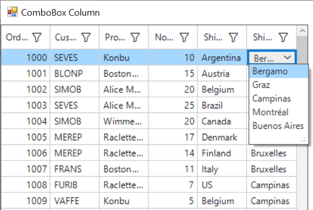

# how-to-pull-down-the-gridcombobox-dropdown-in-tab-key-in-winforms-datagrid

## About the sample
This example illustrates How to pull down the GridComboBox DropDown in Tab key in WinForms DataGrid(SfDataGrid).

By default, drop down of GridComboBoxColumn will open when double clicking the cell. But, you can open the drop down by press the Tab key using a custom renderer can be derived from GridComboBoxCellRenderer. In the custom renderer, the OnKeyUp method can be overridden to show the dropdown.

```C#
public class GridComboBoxCellRendererExt : GridComboBoxCellRenderer
{
    SfDataGrid dataGrid;
    SfComboBox SfCombo;
    public GridComboBoxCellRendererExt(SfDataGrid sfDataGrid)
    {
        dataGrid = sfDataGrid;
    }
    protected override void OnKeyUp(DataColumnBase dataColumn, RowColumnIndex rowColumnIndex, KeyEventArgs e)
    {
        if (e.KeyData == Keys.Tab)
        {
            dataGrid.CurrentCell.BeginEdit();
            //To open the dropdown
            SfCombo.ShowDropDown();
        }
    }
}
```
```C#
//To add custom ComboBox renderer to DataGrid
this.sfDataGrid.CellRenderers.Remove("ComboBox");
this.sfDataGrid.CellRenderers.Add("ComboBox", new GridComboBoxCellRendererExt(sfDataGrid));
//To add a combo box column in grid.
sfDataGrid.Columns.Add(new GridComboBoxColumn() { MappingName = "ShipCityID", HeaderText = "Ship City", ValueMember = "ShipCityID", DisplayMember = "ShipCityName", IDataSourceSelector = new CustomSelector() });
```
## Requirements to run the demo
Visual Studio 2015 and above versions


