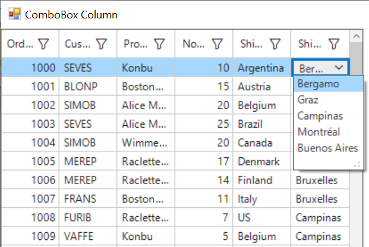

# How to pull down the GridComboBoxColumn dropdown in tab key in WinForms DataGrid?

In [WinForms DataGrid](https://www.syncfusion.com/winforms-ui-controls/datagrid) (SfDataGrid), drop down of GridComboBoxColumn will open when double clicking the cell. But, you can open the drop down by press the Tab key using a custom renderer can be derived from [GridComboBoxCellRenderer](https://help.syncfusion.com/cr/windowsforms/Syncfusion.Windows.Forms.Grid.GridComboBoxCellRenderer.html). In the custom renderer, the OnKeyUp method can be overridden to show the dropdown.

```csharp
public class GridComboBoxCellRendererExt : GridComboBoxCellRenderer
{
    SfDataGrid dataGrid;
    SfComboBox SfCombo;
    public GridComboBoxCellRendererExt(SfDataGrid sfDataGrid)
    {
        dataGrid = sfDataGrid;
    }
    protected override void OnKeyUp(DataColumnBase dataColumn, RowColumnIndex rowColumnIndex, KeyEventArgs e)
    {
        if (e.KeyData == Keys.Tab)
        {
            dataGrid.CurrentCell.BeginEdit();
            //To open the dropdown
            SfCombo.ShowDropDown();
        }
    }
}
```
```csharp
//To add custom ComboBox renderer to DataGrid
this.sfDataGrid.CellRenderers.Remove("ComboBox");
this.sfDataGrid.CellRenderers.Add("ComboBox", new GridComboBoxCellRendererExt(sfDataGrid));

//To add a combo box column in grid.
sfDataGrid.Columns.Add(new GridComboBoxColumn() { MappingName = "ShipCityID", HeaderText = "Ship City", ValueMember = "ShipCityID", DisplayMember = "ShipCityName", IDataSourceSelector = new CustomSelector() });
```



